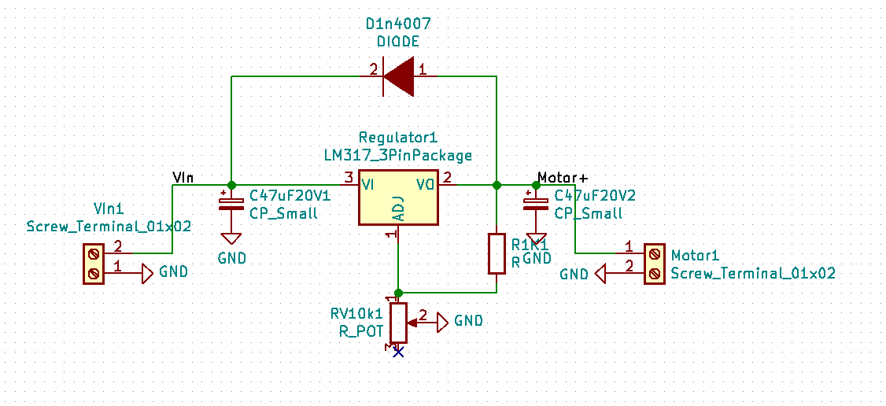
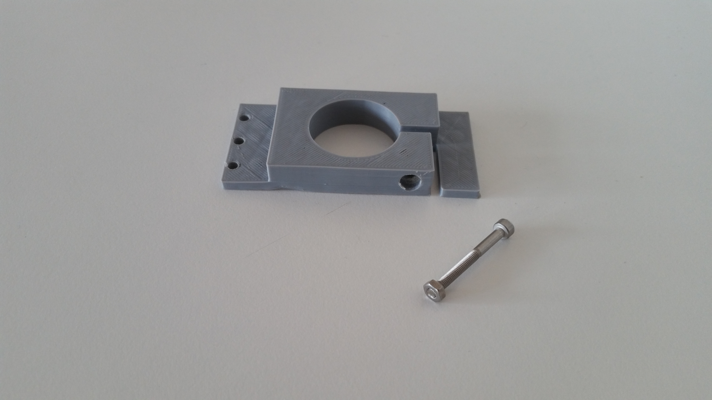
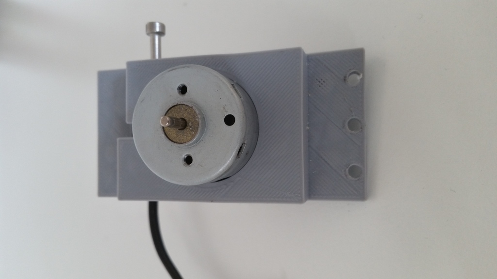
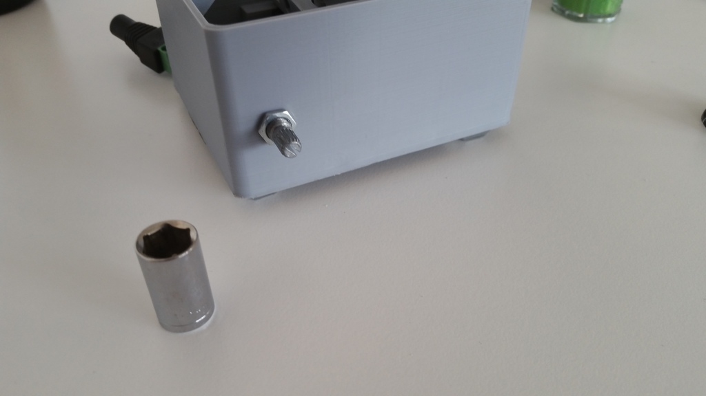
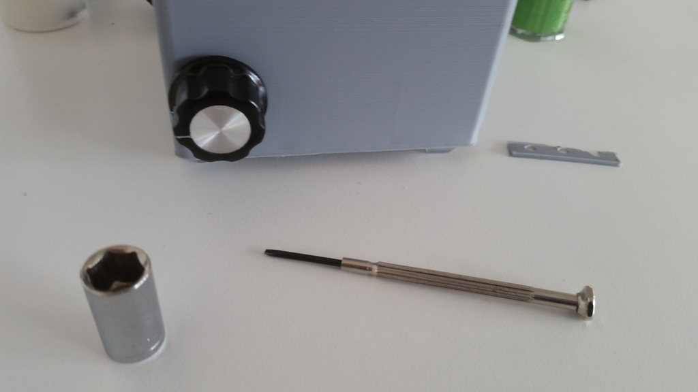
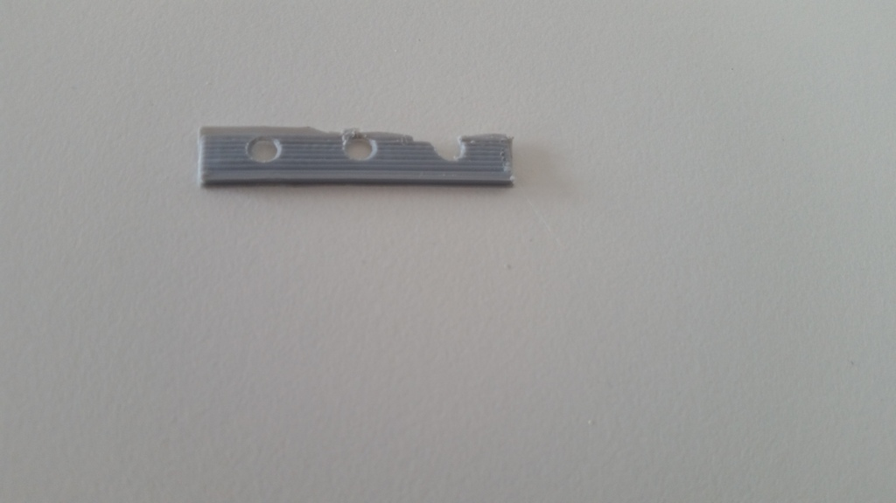
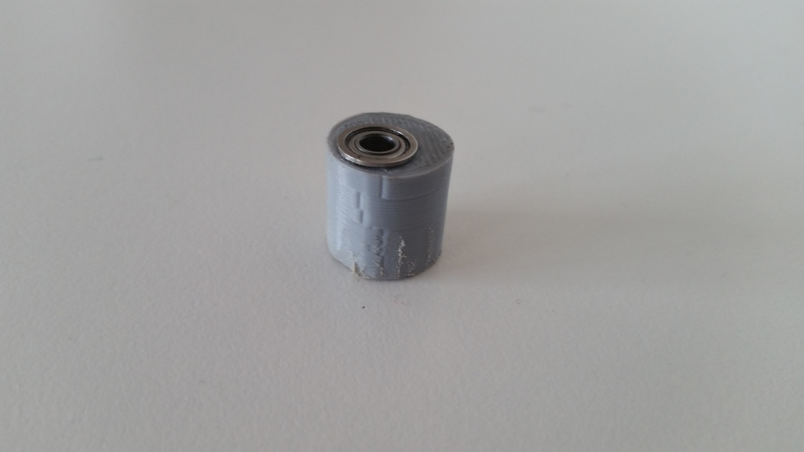
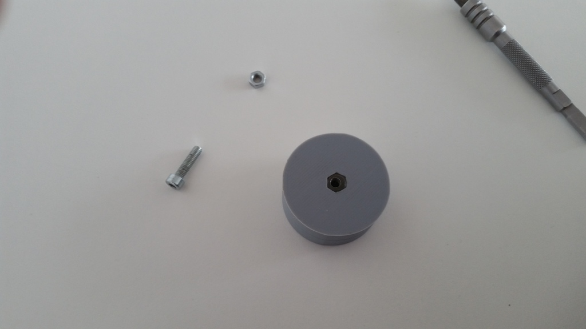
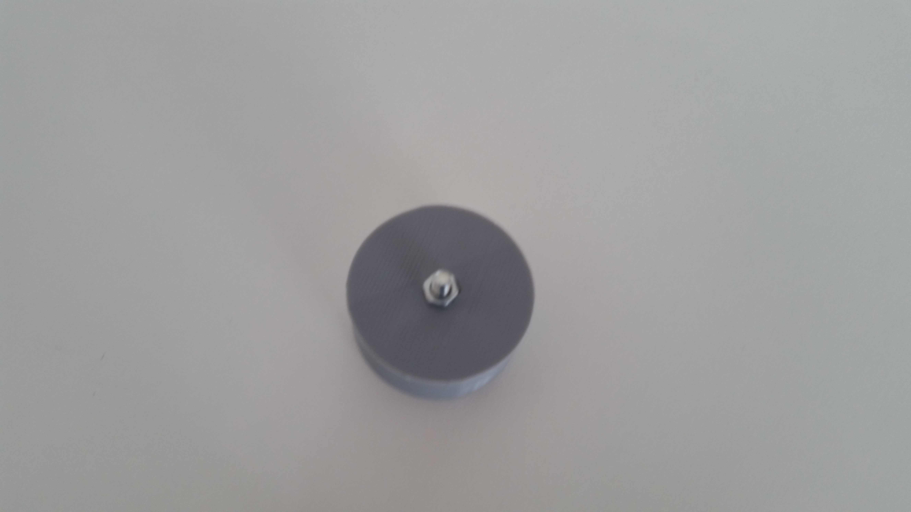
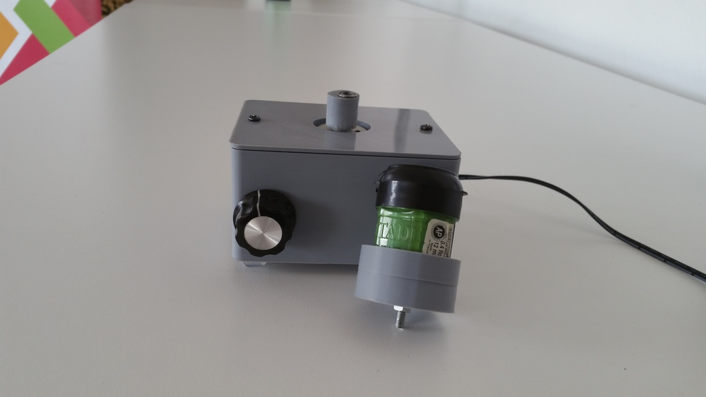

# Vortex Paint Mixer

This is my OpenSource vortex paint mixer.

The reason why i created this, is i wanted to have an easy way to shake my paints. I used an adapter on a jig saw, which worked pretty well but was verry noisy to.

I stumpled over the vortex mixer from NDubiel on thingiverse: https://www.thingiverse.com/thing:534894 which was quite good but i wanted to improve some stuff.

Look the video how it works

## Contribute

When you found a bug or have enhancement feel free to create a pull request or an issue :)

## Software used to create this project

* For 3d modelling: [http://openscad.org](http://openscad.org)
* For the pcb: [http://http://kicad-pcb.org/](http://kicad-pcb.org/)

I thank all the people which make it possible to create a project like this with there free software.

## Scad files

The case / lid and motorclamp scad file is the [scadfiles/case.scad](scadfiles/case.scad)

The top scad file is the [scadfiles/top.scad](scadfiles/top.scad)

## Howto build the mixer

### Tools

  * A 3d printer or use one of the services which print the objects for you
  * Soldering iron
  * Superglue
  * Hotglue gun
  * Optional if you want to create the pcb a mill or edging equipment

### Motorcontroller PCB Components

  * 1 x Diode (for example a 4007)
  * 1 x Poti 10K
  * 2 x Capacitor 47uF at 20V or greater 
  * 1 x LM317
  * 1 x Heatsink for the LM317 **required** 
  * 1 x 1k Resistor
  * 2 x Screw Terminal (Optional) 

### Other electronic Components

  * 12V DC Motor
  * Micro Switch
  * 1 x Powerplug (Optional) 
  * Poti Knob
  * 12 to 20 volt power supply

### General Components

  * 4 x Rubber Foot 
  * 1 x M3 * 30 Bolt + 3M Nut for the motor clamp
  * 5 x M3 tapping screws
  * Bearing for the cuppler
  * For the top 4M x 20 Bolt and 2 4M x Nuts

### Components to print

#### For the Mixer Case:

Print the following parts. Each one time.

I used 20% infill and PLA.

* [stls/case_bottom.stl](stls/case_bottom.stl)
* [stls/motor_clamp.stl](stls/motor_clamp.stl)
* [stls/wedge.stl](stls/wedge.stl)
* [stls/lid.stl](stls/lid.stl)
* [stls/coupler.stl](stls/coupler.stl)

#### For the paint bottle tops

Select the one which yo need.

I used 20% infill and PLA.

* [Vallejo](stls/tops/vallejo_top.stl)
* [Vallejo big bottle](stls/tops/vallejo_big_top.stl)
* [Games Workshop](stls/tops/games_workshop_top.stl)
* [Games Workshop old](stls/tops/games_workshop_old_top.stl)

## Motorcontroller PCB

The schemantics is like this

You can either use the pcb which i generated with KICAD. The project files are located in the folder: **[pcb](pcb)**

If you don't have the possibility to create the pcb you can also freewire the electronics.

## Build Instructions

### Mixer

Hot glue the micro switch into the case and wire the switch to the power plug.

Put the motorclamp and the motor together

Assemble the pcb. Don't forget the heatsink :)

Wire the wires to the pcb from the powerplug, micro switcht and the motor.

Fix the poti with the nut.

Add the knob to the poti

Add the wedge to the motor clamp. Mine broke a little bit when i tokked of the printer. But it is still working. 

¯\\_(ツ)_/¯

Screw the motorclamp into the case.

Screw the lid onto the case.

Superglue the bearing into the coupler.

Put the coupler onto the motor.

## Paint bottle top

Here is a picture of the diffrent tops and the corresponding paint bottles.

Put a M4 nut into the bottom of the top.

Screw a M4 bolt from the other side into the top and put a second M4 nut at the bottom. 

**DONE ! :)**

Just plugin the power and push down the color top into the coupler.

